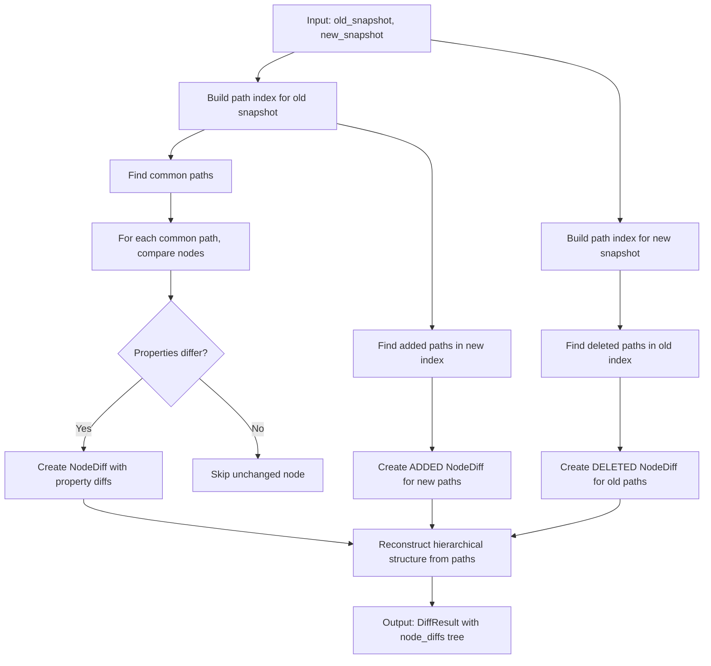
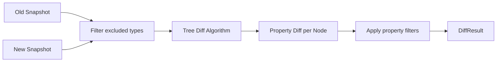

# Task: Phase 3 - Diff Engine Implementation

## Steps

Complete all steps in order, following Test-Driven Development (TDD) approach: write tests first (red), implement code (green), refactor.

### Phase 1: Tree Diff Algorithm (`tree_diff.py`)

- [x] **Step 1.1:** Design path-based indexing algorithm for O(n+m) performance
  - Document algorithm design with Mermaid flowchart
  - Define path index structure: `dict[str, TreeNode]`
- [x] **Step 1.2:** Implement `build_path_index(root_nodes: list[TreeNode]) -> dict[str, TreeNode]`
  - Write test: `test_build_path_index_empty_root_nodes`, `test_build_path_index_single_root_node`, `test_build_path_index_nested_children`
  - Implement recursive tree traversal to build index
- [x] **Step 1.3:** Implement path finding functions
  - Write tests: `test_find_added_paths`, `test_find_deleted_paths`, `test_find_common_paths`
  - Implement `find_added_paths()`, `find_deleted_paths()`, `find_common_paths()` using set operations
- [x] **Step 1.4:** Implement `compare_nodes_by_path(path, old_index, new_index) -> NodeDiff | None`
   - Write test: `test_compare_nodes_identical`, `test_compare_nodes_modified`, `test_compare_nodes_with_excluded_types`
   - Implement node comparison with property-level diffing
   - Apply excluded types filter during comparison
- [x] **Step 1.5:** Implement `reconstruct_hierarchy(node_diffs: list[NodeDiff]) -> list[NodeDiff]`
  - Write test: `test_reconstruct_hierarchy_simple`, `test_reconstruct_hierarchy_nested`
  - Implement parent-child relationship reconstruction from flat path list
- [x] **Step 1.6:** Run existing tests to verify current implementation
   - Execute: `pytest tests/unit/test_tree_diff.py -v`
   - All 33 tests pass

### Phase 2: Property Diff Logic (`property_diff.py`)

- [x] **Step 2.1:** Design type-aware property comparison rules
  - Document comparison rules table for all FreeCAD property types
  - Define float tolerance (1e-9) and special handling for VECTOR, PLACEMENT
- [x] **Step 2.2:** Implement `should_exclude_property(prop_name: str) -> bool`
  - Import EXCLUDED_PROPERTIES from config
  - Test verifies excluded properties are filtered
- [x] **Step 2.3:** Implement `values_are_equal(old_value: PropertyValue | None, new_value: PropertyValue | None) -> bool`
  - Handle None cases (added/deleted properties)
  - Use PropertyValue's built-in equality for type-aware comparison
- [x] **Step 2.4:** Implement `compare_properties(old_props: dict, new_props: dict) -> list[PropertyDiff]`
  - Write test: `test_compare_properties_all_types`, `test_compare_properties_excluded_filtered`, `test_compare_properties_float_tolerance`
  - Iterate through old and new properties, create PropertyDiff for each
  - Apply exclusion filtering
- [x] **Step 2.5:** Create comprehensive unit tests for property_diff module
  - Write test file: `tests/unit/test_property_diff.py`
  - Test all property type comparisons (BOOL, INT, FLOAT, STRING, VECTOR, PLACEMENT, LINK, EXPRESSION)
  - Test float tolerance edge cases
  - Test excluded property filtering

### Phase 3: Diff Engine Orchestration (`diff_engine.py`)

- [ ] **Step 3.1:** Design orchestration flow with filtering
  - Document filtering flow: exclude types -> tree diff -> property diff -> exclude properties
  - Define main entry point signature: `compute_diff(old_snapshot: Snapshot, new_snapshot: Snapshot) -> DiffResult`
- [ ] **Step 3.2:** Implement `filter_snapshot(snapshot: Snapshot) -> Snapshot`
  - Write test: `test_filter_snapshot_excludes_types`, `test_filter_snapshot_removes_subtrees`
  - Remove nodes of excluded TypeIds (PartDesign::Feature, etc.)
  - Recursively filter children
- [ ] **Step 3.3:** Implement `apply_property_filters(property_diffs: list[PropertyDiff]) -> list[PropertyDiff]`
  - Write test: `test_apply_property_filters_excludes_properties`
  - Filter out excluded properties using `should_exclude_property()`
- [ ] **Step 3.4:** Implement `compute_diff(old_snapshot: Snapshot, new_snapshot: Snapshot) -> DiffResult`
  - Write test: `test_compute_diff_end_to_end`, `test_compute_diff_no_changes`, `test_compute_diff_combined_scenarios`
  - Orchestrate: filter snapshots -> compare trees -> compare properties -> apply filters -> return DiffResult
- [ ] **Step 3.5:** Create integration tests for diff_engine module
  - Write test file: `tests/unit/test_diff_engine.py`
  - Test end-to-end diff computation with real-world scenarios
  - Verify excluded types and properties are correctly filtered

### Phase 4: Unit Tests and Integration

- [x] **Step 4.1:** Verify tree_diff unit tests pass
  - Execute: `pytest tests/unit/test_tree_diff.py -v`
  - All tests should pass without FreeCAD dependency
- [x] **Step 4.2:** Create and run property_diff unit tests
  - Execute: `pytest tests/unit/test_property_diff.py -v`
  - Verify all property type comparisons work correctly
- [ ] **Step 4.3:** Create and run diff_engine unit tests
  - Execute: `pytest tests/unit/test_diff_engine.py -v`
  - Verify orchestration and filtering work correctly
- [ ] **Step 4.4:** Run full test suite for diff module
  - Execute: `pytest tests/unit/ -k "tree_diff or property_diff or diff_engine" -v`
  - Ensure all diff-related tests pass together
- [ ] **Step 4.5:** Code quality verification
  - Execute: `ruff check freecad/diff_wb/diff/`
  - Execute: `ruff format freecad/diff_wb/diff/ --check`
  - Fix any linting or formatting issues

## Goal
Implement the core diff computation engine that compares two document snapshots and produces structured diff results, using an efficient path-based indexing strategy for handling documents with thousands of objects.

## Context
Phase 3 focuses on the `diff/` module which contains pure Python algorithms with ZERO FreeCAD dependencies. This is the computational heart of the Diff Workbench.

**User Requirements:**
- Match nodes by `path` attribute (e.g., "Body/Pad", "Body/Pad/ShapeSource")
- Full tree comparison including sub-objects
- Handle documents with thousands of objects efficiently
- Output suitable for rendering a colored tree view showing property differences

## Decisions Made

| Decision | Rationale | Alternatives Considered |
|----------|-----------|------------------------|
| Match by path alone | Paths are unique identifiers within a snapshot; simpler than composite keys | Matching by name+type_id could cause collisions with duplicate names |
| Hierarchical output structure | Preserves document structure for intuitive tree visualization; UI can flatten if needed | Flat list would lose hierarchy context, harder to render indented tree |
| Path-based index for O(1) lookups | Essential for performance with thousands of objects; avoids O(n²) nested loop comparison | Simple nested iteration would be O(n²) - unacceptable at scale |
| Filter excluded types in DiffEngine | Centralizes filtering logic; keeps tree_diff.py pure algorithm | Filtering in SnapshotQuery would lose original data; filtering in UI would be inefficient |
| Float tolerance in comparisons | FreeCAD float values have rounding errors; exact equality fails unnecessarily | Exact equality would show false positives for minor floating-point differences |

## Architecture Impact

**New Modules:**
- `freecad/diff_wb/diff/__init__.py` - Package initialization
- `freecad/diff_wb/diff/tree_diff.py` - Tree comparison algorithm with path indexing
- `freecad/diff_wb/diff/property_diff.py` - Property value comparison logic
- `freecad/diff_wb/diff/diff_engine.py` - Orchestration layer applying filters

**Existing Modules Used:**
- [`domain/snapshot.py`](freecad/diff_wb/domain/snapshot.py) - TreeNode, Snapshot models
- [`domain/diff_result.py`](freecad/diff_wb/domain/diff_result.py) - NodeDiff, PropertyDiff, DiffResult models
- [`domain/property_value.py`](freecad/diff_wb/domain/property_value.py) - PropertyValue comparison
- [`config.py`](freecad/diff_wb/config.py) - EXCLUDED_TYPES, EXCLUDED_PROPERTIES

**Test Files:**
- `tests/unit/test_tree_diff.py` - Tree comparison unit tests
- `tests/unit/test_property_diff.py` - Property comparison unit tests
- `tests/unit/test_diff_engine.py` - End-to-end diff computation tests

## FreeCAD Dependency
- [x] **No FreeCAD required (pure code)** - All diff logic is pure Python with no FreeCAD API calls

## Implementation Plan

### Phase 1: Tree Diff Algorithm (`tree_diff.py`)

**Goal:** Implement efficient tree comparison using path-based indexing

**Algorithm Design:**



**Path Index Structure:**
```python
# Dictionary mapping path -> TreeNode for O(1) lookup
path_index = {
    "Body": TreeNode(...),
    "Body/Pad": TreeNode(...),
    "Body/Pad/ShapeSource": TreeNode(...),
    "Cube": TreeNode(...),
}
```

**Key Functions:**
1. `build_path_index(root_nodes: list[TreeNode]) -> dict[str, TreeNode]` - Build index in O(n)
2. `find_added_paths(old_index, new_index) -> set[str]` - Paths only in new
3. `find_deleted_paths(old_index, new_index) -> set[str]` - Paths only in old
4. `find_common_paths(old_index, new_index) -> set[str]` - Paths in both
5. `compare_nodes_by_path(path, old_index, new_index) -> NodeDiff | None` - Compare two nodes
6. `reconstruct_hierarchy(node_diffs: list[NodeDiff]) -> list[NodeDiff]` - Build tree from flat list

**Performance Target:** O(n + m) where n = old snapshot nodes, m = new snapshot nodes

### Phase 2: Property Diff Logic (`property_diff.py`)

**Goal:** Implement property-level comparison with type-aware equality

**Comparison Rules:**

| Property Type | Comparison Method | Special Handling |
|---------------|-------------------|------------------|
| BOOL | Exact equality | None |
| INT | Exact equality | None |
| FLOAT | Approximate equality (tolerance=1e-9) | Avoid false positives from rounding |
| STRING | Exact equality | None |
| VECTOR | Component-wise approximate equality | Use Vector.__eq__ |
| PLACEMENT | Position + rotation comparison | Use Placement.__eq__ |
| LINK | Exact string equality | None |
| EXPRESSION | String equality | Expression changes are significant |

**Key Functions:**
1. `compare_properties(old_props: dict, new_props: dict) -> list[PropertyDiff]` - Compare all properties
2. `should_exclude_property(prop_name: str) -> bool` - Check exclusion lists
3. `values_are_equal(old_value, new_value) -> bool` - Type-aware equality

**Integration with Config:**
- Import EXCLUDED_PROPERTIES from config
- Skip excluded properties during comparison
- Excluded types handled at engine level (entire node skipped)

### Phase 3: Diff Engine Orchestration (`diff_engine.py`)

**Goal:** Orchestrate tree and property diffing with filtering applied

**Responsibilities:**
1. Accept two Snapshot objects
2. Apply excluded types filter (remove nodes of excluded TypeIds)
3. Call tree_diff to compare filtered snapshots
4. Call property_diff for each node comparison
5. Return structured DiffResult

**Key Functions:**
1. `compute_diff(old_snapshot: Snapshot, new_snapshot: Snapshot) -> DiffResult` - Main entry point
2. `filter_snapshot(snapshot: Snapshot) -> Snapshot` - Remove excluded types
3. `apply_property_filters(property_diffs: list[PropertyDiff]) -> list[PropertyDiff]` - Remove excluded properties

**Filtering Flow:**


### Phase 4: Unit Tests

**Test Strategy:** Pure unit tests with no FreeCAD dependency

**Test Cases for tree_diff.py:**
- Empty snapshots (both empty, one empty)
- Identical snapshots (no differences)
- Simple additions (new object added)
- Simple deletions (object removed)
- Simple modifications (property changed)
- Complex hierarchy changes (nested sub-objects)
- Path collision handling (same name, different paths)
- Performance test with 1000+ nodes

**Test Cases for property_diff.py:**
- All property type comparisons
- Float tolerance verification
- Expression vs value differences
- Excluded property filtering
- PropertyValue equality edge cases

**Test Cases for diff_engine.py:**
- End-to-end diff computation
- Excluded types filtering verification
- Excluded properties filtering verification
- Combined add/delete/modify scenarios
- Snapshot with no changes

## Test Strategy

**Unit Tests (No FreeCAD):**
- Use inline TreeNode/Snapshot construction for test fixtures
- Verify path index builds correctly
- Verify O(1) lookup performance
- Verify hierarchical reconstruction
- Verify property type comparisons
- Verify exclusion filtering

**Sample Test Fixture:**
```python
def test_tree_diff_with_additions():
    old_snapshot = Snapshot(
        document_name="Test",
        timestamp=datetime.now(),
        root_nodes=[
            TreeNode(name="Body", type_id="PartDesign::Body", path="Body", children=[])
        ]
    )
    new_snapshot = Snapshot(
        document_name="Test",
        timestamp=datetime.now(),
        root_nodes=[
            TreeNode(name="Body", type_id="PartDesign::Body", path="Body", children=[]),
            TreeNode(name="Cube", type_id="Part::Box", path="Cube", children=[])
        ]
    )
    
    result = tree_diff.compare_snapshots(old_snapshot, new_snapshot)
    
    assert len(result.added_paths) == 1
    assert "Cube" in result.added_paths
```

## Output Structure Design

**Hierarchical DiffResult (Recommended):**
```python
DiffResult(
    old_snapshot_name="Snapshot1",
    new_snapshot_name="Snapshot2",
    node_diffs=[
        NodeDiff(
            path="Body",
            type_id="PartDesign::Body",
            state=DiffState.MODIFIED,
            property_diffs=[...],
            children=[
                NodeDiff(
                    path="Body/Pad",
                    type_id="PartDesign::Pad",
                    state=DiffState.ADDED,
                    property_diffs=[],
                    children=[]
                )
            ]
        )
    ]
)
```

**Rationale for Hierarchical Output:**
- Preserves document structure for intuitive visualization
- UI can easily render indented tree with collapse/expand
- Parent-child relationships maintained for context
- Can be flattened by UI if needed for specific display modes

**Alternative: Flat List with Paths**
```python
# Less recommended - loses hierarchy context
[
    NodeDiff(path="Body", ...),
    NodeDiff(path="Body/Pad", ...),
    NodeDiff(path="Body/Pad/ShapeSource", ...),
]
```

## Performance Considerations

**Path Index Construction:** O(n) where n = total nodes
**Lookup Operations:** O(1) average case
**Total Comparison:** O(n + m) where n, m = nodes in each snapshot

**Memory Usage:**
- Path index stores references to existing TreeNodes (no duplication)
- DiffResult creates new NodeDiff objects only for changed paths
- For unchanged documents, memory overhead is minimal

**Scalability Target:**
- 100 nodes: < 10ms
- 1000 nodes: < 100ms
- 10000 nodes: < 1 second

## Files to Create

1. `freecad/diff_wb/diff/__init__.py`
2. `freecad/diff_wb/diff/tree_diff.py`
3. `freecad/diff_wb/diff/property_diff.py`
4. `freecad/diff_wb/diff/diff_engine.py`
5. `tests/unit/test_tree_diff.py`
6. `tests/unit/test_property_diff.py`
7. `tests/unit/test_diff_engine.py`

## Success Criteria

- [ ] Path-based index enables O(1) node lookups
- [ ] Tree comparison handles additions, deletions, modifications correctly
- [ ] Property comparison handles all types with appropriate equality rules
- [ ] Excluded types and properties are filtered correctly
- [ ] Output preserves hierarchical structure
- [ ] All unit tests pass without FreeCAD
- [ ] Performance meets scalability targets
- [ ] Code passes ruff linting
- [ ] Type hints complete and accurate

## Notes

- The `diff/` module has ZERO FreeCAD dependencies - fully testable in isolation
- Path matching assumes paths are unique within a snapshot (guaranteed by TreeNode.path construction)
- Float tolerance of 1e-9 matches the tolerance used in Vector and PropertyValue equality
- Excluded types filtering removes entire subtrees (node and all children)
- The hierarchical output can be traversed by UI for tree rendering or flattened for list display
