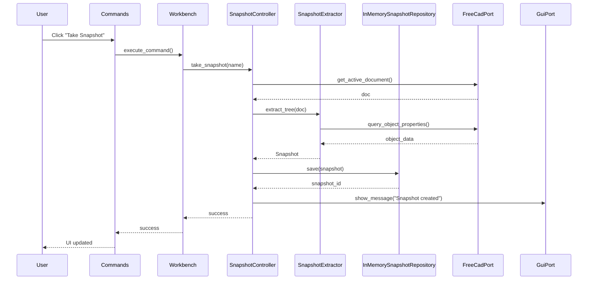
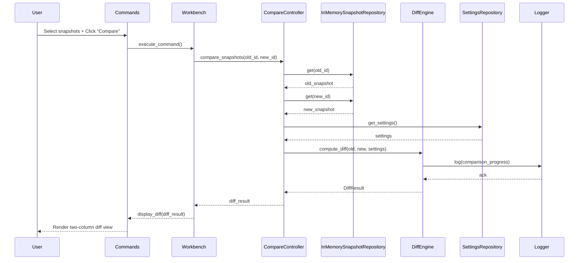

# Diff Workbench Implementation Plan

This document describes the implementation plan for the **Diff Workbench** FreeCAD addon. For architectural details including layered architecture, ports and adapters pattern, and module structure, see [Architecture.md](Architecture.md).

## Goals

- Provide a FreeCAD workbench entrypoint (commands, toolbar/menu, MDI panel)
- Keep the Qt UI layer thin by delegating behavior to application controllers/presenters
- Isolate FreeCAD-specific document queries/mutations from core domain logic
- Make domain modules importable and testable without a running FreeCAD GUI
- Use ports and adapters (infrastructure layer) for runtime boundaries (FreeCAD, GUI, Settings)
- Implement comprehensive linting and unit testing
- Store user-facing documentation in the main README.md at project root

## Configuration (Hard-coded for now)

Configuration is currently hard-coded in `config.py`:

```python
# Hard-coded defaults (will be moved to Preferences in a future phase)
EXCLUDED_TYPES = ["App::Origin"]
EXCLUDED_PROPERTIES = ["TimeStamp", "LastModified", "Label2"]
```

### Future Phase: FreeCAD Preferences Integration

When implemented, the FreeCAD Preferences dialog will have a "Diff Workbench" panel with:

1. **Excluded Types**: Textarea with type IDs, one per line
   - Default: `App::Origin`
   - Objects of excluded types and their children are removed from the diff view

2. **Excluded Properties**: Textarea with property names, one per line
   - Examples: `TimeStamp`, `LastModified`, etc.
   - Excludes properties that create noise in diff views

Implementation note: This can be done using FreeCAD's Parameter system, with `SettingsRepository` reading/writing these preferences.

## Testing Strategy

Following Architecture.md's layered approach with strict test isolation:

### Domain Layer Tests (`tests/unit/domain/`)

Test pure domain logic WITHOUT FreeCAD:

| Test File | Coverage | Location |
|-----------|----------|----------|
| `test_node.py` | TreeNode data model | `unit/domain/tree/` |
| `test_property.py` | Property value models | `unit/domain/tree/` |
| `test_snapshot_models.py` | Snapshot data model | `unit/domain/snapshots/` |
| `test_snapshot_extractor.py` | Tree extraction logic | `unit/domain/snapshots/` |
| `test_tree_diff.py` | Tree comparison algorithms | `unit/domain/diff/` |
| `test_property_diff.py` | Property value comparison | `unit/domain/diff/` |
| `test_diff_engine.py` | End-to-end diff computation | `unit/domain/diff/` |
| `test_logger.py` | Logger port behavior | `unit/domain/logging/` |
| `test_settings.py` | Settings models | `unit/domain/settings/` |
| `test_version.py` | Version parsing/formatting | `unit/` |

Use fakes for repository interfaces (see Architecture.md for details).

### Integration Tests (`tests/integration/`)

Test with real FreeCAD (when available):

| Test File | Coverage | Location |
|-----------|----------|----------|
| `test_freecad_context.py` | FreeCAD runtime context | `integration/infrastructure/freecad/` |
| `test_snapshot_persistence.py` | Snapshot save/load | `integration/infrastructure/persistence/` |
| `test_full_workflow.py` | End-to-end workflows | `integration/` |

## Linting & Quality Tools

Following datamanager patterns:

### Ruff
- `ruff check` for linting
- `ruff format` for formatting
- Configuration in `.ruff.toml`

### Mypy
- Strict type checking for domain/core logic
- Excludes FreeCAD GUI entrypoints
- Configuration in `pyproject.toml`

### Pylint
- Code quality metrics
- Project-specific disables
- Configuration in `pyproject.toml`

### Deadcode
- Detect unused code
- Configuration in `pyproject.toml`

## Implementation Phases

### Architecture Refactoring Phases (Steps 1-5 Complete)

#### Phase 1: Domain Tree Models ✅ (Complete)
- [x] Create `domain/tree/` directory structure
- [x] Move `TreeNode` to `domain/tree/node.py`
- [x] Merge property models into `domain/tree/property.py`
- [x] Update imports in existing code
- [x] Run tests (66 passed)

#### Phase 2: Domain Snapshots ✅ (Complete)
- [x] Create `domain/snapshots/` directory structure
- [x] Move `Snapshot` to `domain/snapshots/models.py`
- [x] Create `domain/snapshots/repository.py` with `SnapshotRepository` protocol
- [x] Create `domain/snapshots/extractor.py` with `SnapshotExtractor`
- [x] Delete old `domain/snapshot.py`
- [x] Run tests (13 + 8 + 6 = 27 passed)

#### Phase 3: Domain Diff ✅ (Complete)
- [x] Create `domain/diff/` directory structure
- [x] Move models to `domain/diff/models.py`
- [x] Create `domain/diff/comparator.py` with `TreeComparator`, `PropertyComparator`
- [x] Create `domain/diff/engine.py` with `DiffEngine`
- [x] Delete old `diff/` directory files
- [x] Run tests (34 + 40 + 66 = 140 passed)

#### Phase 4: Infrastructure Reorganization ✅ (Complete)
- [x] Create `infrastructure/` directory structure
- [x] Create `domain/logging/logger.py` (Logger protocol/port)
- [x] Create `domain/settings/` with `Settings` and `SettingsRepository` protocol
- [x] Move ports to `infrastructure/` as adapters (`FreeCadPort`, `GuiPort`)
- [x] Create `infrastructure/freecad/context.py` (FreeCadPort adapter)
- [x] Create `infrastructure/freecad/settings_repo.py` (SettingsRepository adapter)
- [x] Create `infrastructure/gui/qt_adapter.py` (GuiPort adapter)
- [x] Update all imports
- [x] Run tests (167 passed)

#### Phase 5: Cleanup and Migration ✅ (Complete)
- [x] Remove old directories (`domain/snapshot.py`, `domain/property_value.py`, `snapshot/`, `diff/`, `ports/`)
- [x] Update `config.py` with deprecation comments
- [x] Update entrypoints for dependency injection
- [x] Run full test suite (161 passed)
- [x] Run linter checks (all passed)

### Phase 6: Documentation ✅ (Complete)
- [x] Update `PLAN.md` with new architecture references
- [x] Mark Phase 1-5 as complete
- [x] Update module map with new structure
- [x] Update import path examples
- [x] Verify `ARCHITECTURE.md` accuracy
- [x] Create migration guide in `development.md`

### Future Phases (Post-Refactoring)

#### Phase 7: Application Layer ❌ (Not Started)
- [ ] Create `application/` directory structure
- [ ] Implement `SnapshotController` use case in `application/controllers/`
- [ ] Implement `CompareController` use case in `application/controllers/`
- [ ] Implement presenters in `application/presenters/`

#### Phase 8: UI Implementation ❌ (Not Started)
- [ ] Qt Designer file (`resources/ui/diff_panel.ui`)
- [ ] Main panel widget (`application/ui/diff_panel.py`)
- [ ] MDI subwindow management via `GuiPort` adapter

#### Phase 9: Preferences Integration ❌ (Not Started)
- [ ] FreeCAD Preferences dialog panel
- [ ] Settings persistence via `SettingsRepository`
- [ ] Dynamic reload of excluded types/properties

#### Phase 10: Testing & Polish ❌ (Not Started)
- [ ] Integration tests
- [ ] Icon design/finalization
- [ ] Performance optimization
- [ ] User documentation (README.md)


## Differences from DataManager

| Aspect | DataManager | Diff Workbench |
|--------|-------------|----------------|
| **Panel Type** | Tabbed MDI subwindow | Single-panel MDI subwindow |
| **Layout** | Two tabs (VarSets, Aliases) | Two columns (old, new) |
| **Storage** | Live document access | In-memory snapshots |
| **Actions** | Remove unused references | Compare, swap columns |
| **Docs Location** | mkdocs documentation | README.md at root |
| **Configuration** | Per-tab display modes | Hard-coded (Preferences in Phase 7) |

## Key Flows

### Take Snapshot Flow



### Compare Snapshots Flow



## Configuration Files to Create

1. `pyproject.toml` - Project metadata, dependencies, tool configuration
2. `.ruff.toml` - Ruff linting rules
3. `CMakeLists.txt` - FreeCAD addon registration
4. `package.xml` - FreeCAD addon metadata
5. `MANIFEST.in` - Package inclusion rules
6. `.editorconfig` - Editor consistency
7. `tests/conftest.py` - pytest fixtures
8. `docs/Architecture.md` - Architecture documentation (complete)

## Success Criteria

- [ ] Workbench registers correctly in FreeCAD
- [ ] Snapshot creation works for active document
- [ ] Diff computation produces accurate results
- [ ] UI displays two-column diff with proper coloring
- [ ] Unit tests pass without FreeCAD runtime
- [ ] Integration tests pass with FreeCAD runtime
- [ ] Linting passes (ruff, mypy, pylint)
- [ ] Documentation is clear and complete

## Notes

- User documentation stays in main README.md
- Configuration is hard-coded for now; Preferences integration via `SettingsRepository` is future phase
- MDI subwindow layout like DataManager
- See Architecture.md for layer responsibilities, dependency rules, and module boundaries
