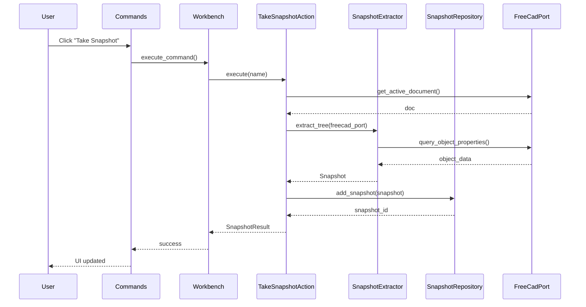
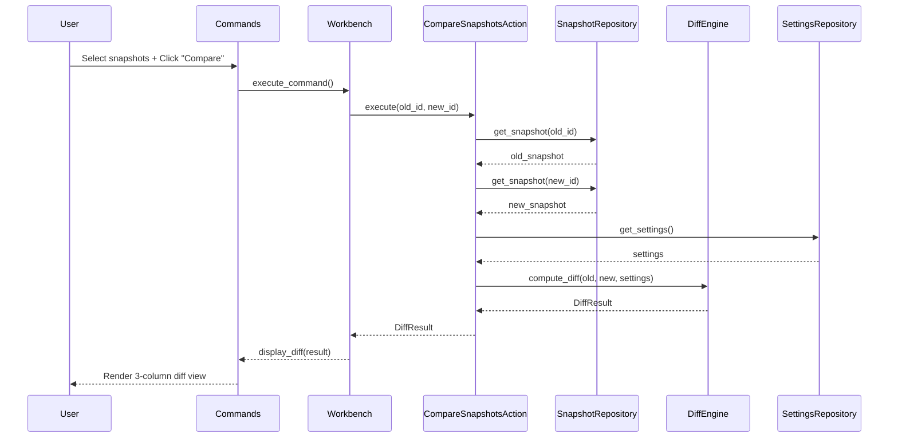

# Diff Workbench Implementation Plan

This document describes the implementation plan for the **Diff Workbench** FreeCAD addon. For architectural details including layered architecture, ports and adapters pattern, and module structure, see [Architecture.md](Architecture.md).

## Goals

- Provide a FreeCAD workbench entrypoint (commands, toolbar/menu, MDI panel)
- Keep the Qt UI layer thin by delegating behavior to application controllers/presenters
- Isolate FreeCAD-specific document queries/mutations from core domain logic
- Make domain modules importable and testable without a running FreeCAD GUI
- Use ports and adapters (infrastructure layer) for runtime boundaries (FreeCAD, GUI, Settings)
- Implement comprehensive linting and unit testing
- Store user-facing documentation in the main README.md at project root

## Configuration (Hard-coded for now)

Configuration is currently hard-coded in `config.py`:

```python
# Hard-coded defaults (will be moved to Preferences in a future phase)
EXCLUDED_TYPES = ["App::Origin"]
EXCLUDED_PROPERTIES = ["TimeStamp", "LastModified", "Label2"]
```

### Future Phase: FreeCAD Preferences Integration

When implemented, the FreeCAD Preferences dialog will have a "Diff Workbench" panel with:

1. **Excluded Types**: Textarea with type IDs, one per line
   - Default: `App::Origin`
   - Objects of excluded types and their children are removed from the diff view

2. **Excluded Properties**: Textarea with property names, one per line
   - Examples: `TimeStamp`, `LastModified`, etc.
   - Excludes properties that create noise in diff views

Implementation note: This can be done using FreeCAD's Parameter system, with `SettingsRepository` reading/writing these preferences.

## Testing Strategy

Following Architecture.md's layered approach with strict test isolation:

### Unit Tests (No FreeCAD)

**Location**: `tests/unit/`

**Coverage**:
- Domain models and services
- Repository interfaces (with fakes)
- Diff algorithms
- Tree extraction logic
- Application actions (with mocks)

**Characteristics**:
- Pure Python, no FreeCAD imports
- Fast execution (< 1 second total)
- Use inline fixtures and fakes

### Integration Tests (With FreeCAD)

**Location**: `tests/integration/`

**Coverage**:
- Infrastructure adapters
- FreeCAD context handling
- Full end-to-end workflows

**Characteristics**:
- Requires FreeCAD runtime
- Slower execution
- Test real FreeCAD API interactions

## Linting & Quality Tools

Following datamanager patterns:

### Ruff
- `ruff check` for linting
- `ruff format` for formatting
- Configuration in `.ruff.toml`

### Mypy
- Strict type checking for domain/core logic
- Excludes FreeCAD GUI entrypoints
- Configuration in `pyproject.toml`

### Pylint
- Code quality metrics
- Project-specific disables
- Configuration in `pyproject.toml`

### Deadcode
- Detect unused code
- Configuration in `pyproject.toml`

## Implementation Phases

### Architecture Refactoring Phases (Steps 1-6 Complete)

**Phase 1-6**: Domain, Infrastructure, and Application Layer refactoring complete. See git history for details.

### MVP Implementation Phases

**Incremental Development Approach**: Each phase should be completed and tested in FreeCAD before moving to the next. This allows you to:
- Verify UI changes visually without complex setup
- Learn FreeCAD/Qt concepts gradually
- Get immediate feedback on each feature
- Avoid debugging multiple unknowns at once

See [UI.md](UI.md) for detailed UI requirements.

#### Phase 7: Application Layer ✅ (Complete)
- [x] Create `application/actions/commands/take_snapshot.py` - `TakeSnapshotAction`
- [x] Create `application/actions/commands/compare_snapshots.py` - `CompareSnapshotsAction`
- [x] Create `application/actions/queries/list_snapshots.py` - `ListSnapshotsQuery`
- [x] Create `application/di/container.py` - Dependency injection container
- [x] Wire actions and presenters in container
- [x] Register commands in `entrypoints/commands.py`

#### Phase 8: 3-Column Window + Show on Activation ❌ (Not Started)
- [ ] Create `ui/diff_panel.py` with horizontal `QSplitter`
- [ ] Three columns: `QListWidget` (Snapshots) | `QTreeWidget` (Tree) | `QTableWidget` (Properties)
- [ ] Empty columns, no data wiring yet
- [ ] Wire to show when Diff workbench activates in `workbench.py`
- [ ] **Test**: Switch to Diff workbench → see empty 3 columns

#### Phase 9: Populate Snapshots Column ❌ (Not Started)
- [ ] Wire `ListSnapshotsQuery` to load snapshots on panel show
- [ ] Display snapshot names + timestamps (newest first)
- [ ] **Test**: Take snapshot → appears in list

#### Phase 10: Snapshot Selection ❌ (Not Started)
- [ ] Single click: select one snapshot
- [ ] Ctrl+click: select second snapshot (first = "from", second = "to")
- [ ] Visual indicator of selection state
- [ ] **Test**: Can select 1-2 snapshots

#### Phase 11: Compare Command → Tree Diff ❌ (Not Started)
- [ ] "Compare" button triggers `CompareSnapshotsAction`
- [ ] Display diff tree in Tree column (changed nodes only)
- [ ] Color coding: green=added, red=removed, blue=modified
- [ ] Preserve node indentation from FreeCAD feature tree
- [ ] Expand/collapse children with +/- icons
- [ ] **Test**: Select 2 snapshots → Compare → see tree diff

#### Phase 12: Node Selection → Properties Diff ❌ (Not Started)
- [ ] Click node in Tree → show property diff in Properties column
- [ ] Two sub-columns: Property Key | Property Value
- [ ] Color coding: red=deleted, green=added, blue=modified
- [ ] Handle expression diffs (two rows if needed)
- [ ] **Test**: Click node → see property changes

#### Phase 13: Polish & Preferences ❌ (Not Started)
- [ ] FreeCAD Preferences dialog (optional for MVP)
- [ ] Icon design/finalization
- [ ] Integration tests
- [ ] User documentation (README.md)


## Differences from DataManager

| Aspect | DataManager | Diff Workbench |
|--------|-------------|----------------|
| **Panel Type** | Tabbed MDI subwindow | 3-column MDI subwindow |
| **Layout** | Two tabs (VarSets, Aliases) | Snapshots \| Tree \| Properties |
| **Storage** | Live document access | In-memory snapshots |
| **Actions** | Remove unused references | Compare, swap columns |
| **Docs Location** | mkdocs documentation | README.md at root |
| **Configuration** | Per-tab display modes | Hard-coded (Phase 13 optional) |

## Key Flows

### Take Snapshot Flow



### Compare Snapshots Flow



## Configuration Files to Create

1. `pyproject.toml` - Project metadata, dependencies, tool configuration
2. `.ruff.toml` - Ruff linting rules
3. `CMakeLists.txt` - FreeCAD addon registration
4. `package.xml` - FreeCAD addon metadata
5. `MANIFEST.in` - Package inclusion rules
6. `.editorconfig` - Editor consistency
7. `tests/conftest.py` - pytest fixtures
8. `docs/Architecture.md` - Architecture documentation (complete)

## Success Criteria

- [ ] Workbench registers correctly in FreeCAD
- [ ] Snapshot creation works for active document
- [ ] Diff computation produces accurate results
- [ ] UI displays two-column diff with proper coloring
- [ ] Unit tests pass without FreeCAD runtime
- [ ] Integration tests pass with FreeCAD runtime
- [ ] Linting passes (ruff, mypy, pylint)
- [ ] Documentation is clear and complete

## Notes

- User documentation stays in main README.md
- Configuration is hard-coded for now; Preferences integration via `SettingsRepository` is future phase
- MDI subwindow layout like DataManager
- See Architecture.md for layer responsibilities, dependency rules, and module boundaries
