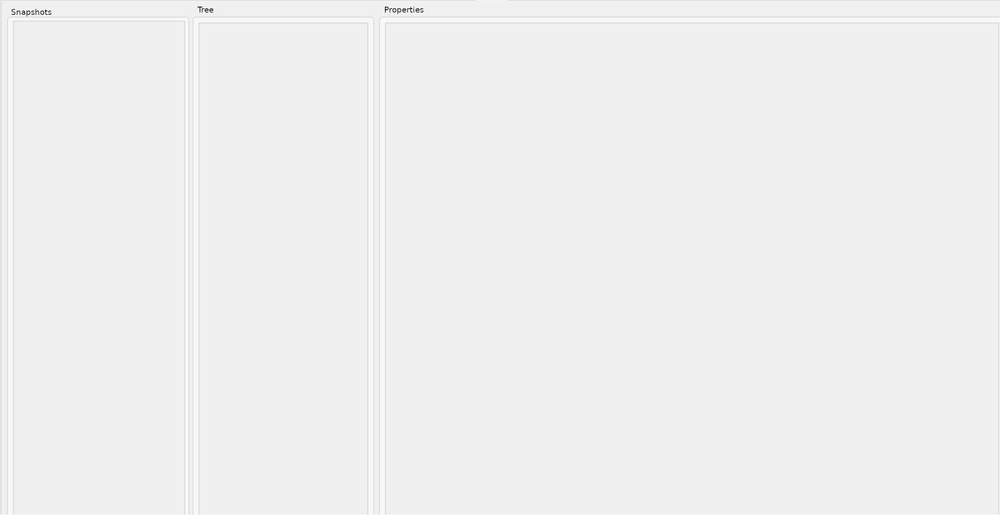

## UI Requirements

Columns:
- First column: Snapshots -- lists all snapshots stored in memory, in desc order by timestamp
- Second column: Tree -- show the tree diff
- Third column: Properties -- shows the property diff view. This column is itself subdivided into 2 columns: property key and property value.

When first opening this UI view, the Tree and Properties columns are empty.

The UI should be responsive to window size, so that if it's resizes, the columns resize proportionally.

When there are two snapshots available in the Snapshots column, it will be possible to click on one, then CTRL+click the second. The first selected snapshot is the "from" snapshot, the second is the "to" snapshot. If that is too complicated to implement, then the "from" snapshot is the one with the earlier date.

Once two snapshots are selected, and the "Compare" command is clicked, the diff is generated, and the tree is presented in the Tree view. The indentation of each child must be preserved just like the main FreeCAD feature tree.

The tree only contains "branches" where the diff resulted in changes. Features which are modified have blue text. Features which are added have green text, and features which have been deleted have red text.

All nodes in the tree that have children have a little "plus" icon to the left to expand/collapse the children.

When a feature is clicked, its properties are displayed in the Properties column, per the same color identification as the tree: red for deleted properties, green for added properties, and blue for modified properties.

In most cases a property diff is just one row: the left column shows the property key, and the right column shows the modification in format "[Old Value] -> [New Value]". However, if there are diffs in expressions (expression modified, added, or deleted), then the property value column has two rows: one for the value changes (if any), and one for the expression changes (if any). If no changes for one of them, the text remains the standard black.

